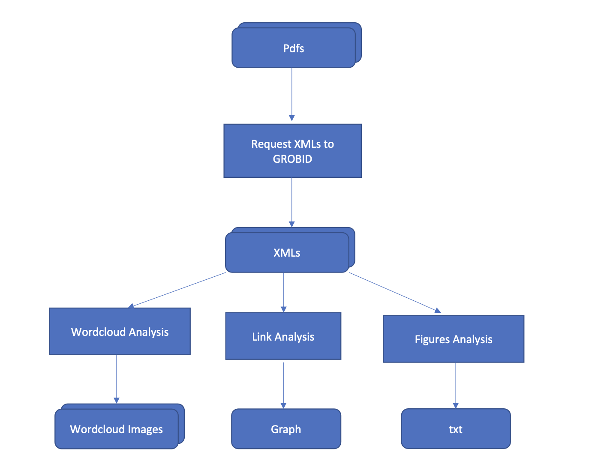

[](https://zenodo.org/badge/latestdoi/596545346)

# AI and Open Science In Research Software Engineering subject repository with deliverables 

This repository has been created with the purpose of uploading all the deliverables of the personal assigment from the subject called "AI and Open Science In Research Software Engineering".

The assigment consists of analysing each paper and doing what's asked of me in the following steps, using Python as the language of choice:

- Draw a keyword cloud based on the abstract information.
- Create a visualization showing the number of figures per article.
- Create a list of links found in each paper. 

The explanation of how I solved the three tasks mentioned above is in the file called **"rationale.md"**

**DISCLAIMER: YOU CAN RUN THIS SOFTWARE USING A VIRTUAL ENVIROMENT OR **DOCKER**, THE INSTRUCTIONS FOR RUNNING IT WITH DOCKER CAN BE FOUND ALMOST AT THE BOTTOM OF THIS READ ME FILE FROM THE 'How to execute this project with docker' SUBTITLE, ALSO YOU CAN CHECK IT OUT WITH EXAMPLES ON THIS DOCUMENTATION LINK: https://aiandopenscienceinresearchsoftwareengineering.readthedocs.io/en/latest/run_docker.html**


## Requirements
- Having Python installed. 
- Installing pip
- Python library: BeautifulSoup
- Python parser: lxml 
- Install Image
- Installing Numpy
- Installing Docker
- Docker compose

## How to run the three python scripts with a virtual enviroment

If you want to run this project using a virtual enviroment instead of Docker, go over to this link: https://aiandopenscienceinresearchsoftwareengineering.readthedocs.io/en/latest/envi.html and you'll find all of the instructions on how to do it from the 'How to execute in a virtual enviroment' section to the 'Where to find the output files of each Python script' one.

# How to execute this project with docker

**If you want to follow the next instructions with examples head over to this next link:
https://aiandopenscienceinresearchsoftwareengineering.readthedocs.io/en/latest/run_docker.html, if not, just keep reading**

First you have to make sure that you have your xmls ready so you can execute the Python scripts using Docker containers, for this, follow the next steps:

## How to get your xmls from your own pdfs 

1. Make sure you have GROBID server running, you can do this using Docker make sure you have it installed and the run the next commands in your terminal:
- Pull the GROBID image: 
```bash
  docker pull lfoppiano/grobid:0.7.2
```
- Run the image:
```bash
  docker run -t --rm -p 8070:8070 lfoppiano/grobid:0.7.2
```
The web service will be running in http://localhost:8070/

2. Now copy and paste your pdfs into the directory called 'Papers', that you'll find inside the directory called 'compose', which location is: './AIandOpenScienceInResearchSoftwareEngineering-main/Docker/compose'.
 
3. Now in your terminal, make sure that you are inside the directory 'compose' which location is: './AIandOpenScienceInResearchSoftwareEngineering-main/Docker/compose', and run the next command:
```bash
  python request_grobid.py
```
This runs a Python script that'll connect to the GROBID server using the Grobid Python client library, it downloads all of the XML of the pdfs inside the 'Papers' directory, this might take a few minutes, if it takes too long stop the Grobid container, start it again and execute request_grobid.py again.
After request_grobid.py has finished executing, check that all of the XMLs are inside the 'Papers' directory and continue with the next steps:

## Now that you have all of your XMLs, run the Python scripts with Docker compose

For it to run in your computer, follow the next steps:

**IMPORTANT:** Make sure that you have docker compose downloaded on your machine so you can execute this project using containers.

1. Open your console and change directories until you are inside the directory named 'Docker' and then change directories once more to the directory inside 'Docker' called 'compose' ('./AIandOpenScienceInResearchSoftwareEngineering-main/Docker/compose)'.
```bash
  cd AIandOpenScienceInResearchSoftwareEngineering-main/Docker/compose
```
2. Once you are inside the 'compose' directory, run the next command on your terminal:
```bash
  docker-compose up --build
```
3. After you've run the prior command all of the output files from each of the Python files should be found on the directory called 'result_files' that can be found inside the directory 'compose'.

4. Now, type the next command:
```bash
  docker-compose down
```

And that's it! Now you have all of the output files in your computer :)

## Tests
The unittests used to make this project worked succesfully can be found inside the '2ndAssigment' directory.

## Workflow diagram


## Documentation
You can check out this software's documentation on the next link:

http://aiandopenscienceinresearchsoftwareengineering.readthedocs.io/


